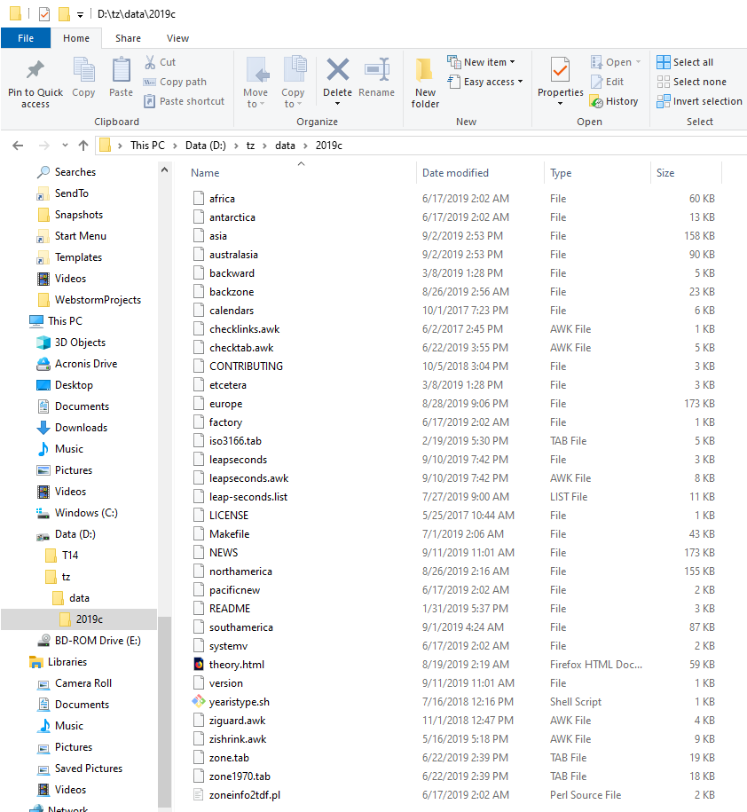

# ianatzformatInfo

This program is written in the [Go Programming Language](https://golang.org/), a.k.a. ***Golang***.  The application executable is, ***ianatzformatInfo.exe***.

The objective of this application is to create types and data structures for use in _**Go**_ programs.  Time Zone information for these data structures is parsed, formatted and extracted from raw IANA Time Zone data files.

The source code file generated by this application allows developers to quickly access time zones using pseudo enumeration syntax illustrated by the following examples.

```
TZones.America.Chicago()   // America/Chicago USA Central Time Zone

TZones.America.New_York()  // America/New_York USA Eastern Time Zone

TZones.America.Denver()    // America/Denver USA Mountain

Time Zone TZones.America.Los_Angeles() // America/Los_Angeles USA Pacific Time Zone

TZones.America.Argentina().Buenos_Aires() // America/Argentina/Buenos_Aires Time Zone
```


## Table of Contents

+ [ianatzformatInfo](#ianatzformatinfo)
+ [Supported Platforms](#supported-platforms)
+ [Software Version](#software-version)
+ [License](#license)
+ [IANA Time Zones](#iana-time-zones)
+ [Go Relies on the IANA Time Zone Database](#go-relies-on-the-iana-time-zone-database)
    - [LoadLocation](#loadlocation)
    - [Updating Time Zone Data For Your Go Installation](#updating-time-zone-data-for-your-go-installation)
    - [Time Package References](#time-package-references)
+ [Application Processing](#application-processing)
+ [Base Input Data](#base-input-data)
    - [Input File Example](#input-file-example)
        + [Line 1](#line-1)
        + [Line 2](#line-2)
        + [Configuration](#configuration)
+ [Create Source IANA Time Zone Information](#create-source-iana-time-zone-information)
    - [Step-1 Identify the Desired IANA Time Zone Data Version](#step-1-identify-the-desired-iana-time-zone-data-version)
        + [a. Access the IANA Time Zone Website](#a-access-the-iana-time-zone-website)
        + [b. Record the Target Time Zone Version Number](#b-record-the-target-time-zone-version-number)
    - [Step-2 Create the Time Zone Data Directory](#step-2-create-the-time-zone-data-directory)
    - [Step-3 Navigate to Time Zone Data Directory](#step-3-navigate-to-time-zone-data-directory)
    - [Step-4 Create the Time Zone Version Directory](#step-4-create-the-time-zone-version-directory)
    - [Step-5 Execute Bash Commands](#step-5-execute-bash-commands)
        + [Execute Bash Command \#1 - Set Environment to Exit on Error](#execute-bash-command-1---set-environment-to-exit-on-error)
        + [Execute Bash Command \#2 - Download Time Zone Data Tar Archive](#execute-bash-command-2---download-time-zone-data-tar-archive)
        + [Execute Bash Command \#3 - Unzip Time Zone Data Tar Archive](#execute-bash-command-3---unzip-time-zone-data-tar-archive)
        + [Execute Bash Command \# 4 - Verify Time Zone Data Extraction](#execute-bash-command--4---verify-time-zone-data-extraction)
        + [Step-6 Include Time Zone Version Directory in targettzdata.txt](#step-6-include-time-zone-version-directory-in-targettzdatatxt)
+ [Application Output](#application-output)
    - [Output Go Source File: timezonedata.go](#output-go-source-file-timezonedatago)
    - [Execution Output Text](#execution-output-text)
        - [Successful Execution](#successful-execution)
        - [Failed Execution](#failed-execution)
        - [Piping Execution Results To A Text File](#piping-execution-results-to-a-text-file)
+ [***ianatzformatInfo*** Is A Research and Demonstration Project For ***Go Modules***](#ianatzformatinfo-is-a-research-and-demonstration-project-for-go-modules)
    - [***Go Modules***](#go-modules)
    - [Design Objective: Component Directory Structure](#design-objective-component-directory-structure)
    - [Directory Layout for ***ianatzformatInfo***](#directory-layout-for-ianatzformatinfo)
+ [Building The ***ianatzformatInfo*** Executable](#building-the-ianatzformatinfo-executable)
    - [Build Executable Step \#1](#build-executable-step-1)
    - [Build Executable Step \#2](#build-executable-step-2)
    - [Build Executable Step \#3](#build-executable-step-3)
    - [Executables Stored In Project](#executables-stored-in-project)
        - [Linux Executable](#linux-executable)
            + [Linux Executable Create Date](#linux-executable-create-date)
            + [Linux Executable Checksum](#linux-executable-checksum)
        - [Windows Executable](#windows-executable)
            + [Windows Executable Create Date](#windows-executable-create-date)
            + [Windows Executable Checksum](#windows-executable-checksum)
+ [Questions And Comments](#questions-and-comments)

---

## Supported Platforms

This application was designed to operate on multiple operating systems including 
Mac-OS, Linux and Windows.

**However, to date, this application has only been tested successfully on Windows and Linux Mint 19-2.**


## Software Version

This is ***ianatzformatInfo.exe*** Version 1.0.0.

This version DOES support ***Go*** modules.

This version requires ***Go*** Version 1.13 or later.

This version was developed and tested using ***Go*** version 1.13.3. 


## License

Copyright 2019 Mike Rapp. All rights reserved.

Use of this source code is governed by the (open-source) MIT-style
license which can be found in the LICENSE file located in this directory.

[MIT Open Source License](./LICENSE)


## IANA Time Zones

The IANA Time Zone database is widely recognized as the the world's leading authority on time zones.

Reference:

​    <https://en.wikipedia.org/wiki/List_of_tz_database_time_zones>

​    <https://en.wikipedia.org/wiki/Tz_database>

​    <https://www.iana.org/time-zones>

The **Go** Programming Language uses IANA Time Zones in date-time calculations.

Reference:

[https://golang.org/pkg/time/#LoadLocation](https://golang.org/pkg/time/#LoadLocation)

This application assumes that Time Zone data has been downloaded

Current IANA Time Zone data base information is located at:

[https://www.iana.org/time-zones](https://www.iana.org/time-zones)

For a listing of all time zone database releases, reference:

[https://data.iana.org/time-zones/releases/](https://data.iana.org/time-zones/releases/)


## Go Relies on the IANA Time Zone Database

The ***Go Programming Language*** uses IANA Time Zones in date-time calculations. The following was taken form the [Go Time Package](https://golang.org/pkg/time/) documentation for ***LoadLocation***.

### LoadLocation

Reference:  <https://golang.org/pkg/time/#LoadLocation>

func ***LoadLocation***(***name*** string) (***Location***, error)

***LoadLocation*** returns the Location with the given name.

If the ***name*** is "" or “UTC”, LoadLocation returns [**UTC**](https://en.wikipedia.org/wiki/Coordinated_Universal_Time).

If the ***name*** is "Local", ***LoadLocation*** returns the location, ***Local***. (***Local*** represents the system's local time zone.)

Otherwise, the ***name*** is taken to be a location name corresponding to a file in the [IANA Time Zone database](https://www.iana.org/time-zones), such as "America/New\_York".

The time zone database needed by ***LoadLocation*** may not be present on all systems, especially non-Unix systems. ***LoadLocation*** looks in the directory or uncompressed zip file named by the ***ZONEINFO*** environment variable, if any, then looks in known installation locations on Unix systems, and finally looks in ***$GOROOT/lib/time/zoneinfo.zip***.


### Updating Time Zone Data For Your Go Installation

Although not part of the ***ianatzformatInfo.exe*** application, you should be aware that the ***Go Programming Language*** allows end users to update the IANA Time Zone Database used in ***Go*** date/time calculations. For more information on the time zone update procedure, see [***TimeZoneDatabaseUpdates.md***](./xtechnotes/TimeZoneDatabaseUpdates.md) .


### Time Package References

The following reference articles provide information on time zones and the ***Go*** Time Package:

 [**Go Time Package**](https://golang.org/pkg/time/)

 [**Detect if ZONEINFO fails in Go - Stack Overflow**](https://stackoverflow.com/questions/51053321/detect-if-zoneinfo-fails-in-go)

  [**Package time - Mastering Go**](https://code-examples.net/en/docs/go/time/index)

 [**knozone**](https://github.com/slotheroo/knozone)


## Application Processing

Using the ***ianatzformatInfo.exe*** application, information is extracted from raw IANA Time Zone source files and reformatted as a series of  types and data structures stored in a source file suitable for use in a ***Go*** program.  This source code file generated by the application is named, [***timezonedata.go***](./app/output/timezonedata.go).

The raw IANA Time Zone source files must be downloaded by the end user and stored in a directory which is accessible to ***ianatzformatInfo.exe***.


## Base Input Data

In order to function properly, this application expects to find the text file [***targettzdata.txt***](./app/input/targettzdata.txt) in a sub-directory labeled *input* which is located directly beneath the directory which houses this application executable (***ianatzformatInfo.exe***).  This text file contains the path to the IANA Time Zone data and the path in which the output source code file ([***timezonedata.go***](./app/output/timezonedata.go)) will be created.

#### Input File Example
Assume application executable, *ianatzformatInfo.exe*, is located in **D:\myAppDir** .

Input File [***targettzdata.txt***](./app/input/targettzdata.txt) MUST BE located in a directory named ***input*** which is a sub-directory underneath the application directory:

        'D:\myAppDir\input\targettzdata.txt'

[***targettzdata.txt***](./app/input/targettzdata.txt) is a text file containing two lines of information on the first two lines in the text file.

Each line of text must be terminated with a new line character, **\n**.

##### Line 1

The first line designates the 'path' to the IANA time zone source data files. The application will search this path for valid IANA time zone database files and these files will be used as application input.

##### Line 2

The second line designates the path to the output file.

The application will create the output file [***timezonedata.go***](./app/output/timezonedata.go) in this output directory.  This ***Go*** source file will contain data structures used to access world wide time zones.

##### Configuration
Configure these two lines in accordance with the following example:

    InputDirectory: D:\tz\data\2019c
    OutputDirectory: D:\GoProjects\ianatzformatInfo\app\output

The leading field names, **InputDirectory:** and **OutputDirectory:** are mandatory.  Each must be followed by a colon (**:**)  and a space.  Also, remember that each line must be terminated by a new line character, **\n** .


## Create Source IANA Time Zone Information

The application ***ianatzformatInfo.exe*** expects to find raw IANA Time Zone data files in the output directory (***OutputDirectory:***) field of the [***targettzdata.txt***](./app/input/targettzdata.txt) file described above. The following steps outline the procedure for downloading IANA Time Zone data files to a local directory on your computer.

### Step-1 Identify the Desired IANA Time Zone Data Version

#### a. Access the IANA Time Zone Website

You have two choices.  If you seek the latest version of time zone data, point your browser at:

​		[**https://www.iana.org/time-zones**](https://www.iana.org/time-zones)

On the other hand, if you are targeting an earlier version of time zone data, point your browser at the release history web site:

​		 [**https://data.iana.org/time-zones/releases/**](https://data.iana.org/time-zones/releases/)


#### b. Record the Target Time Zone Version Number

Make a note of the desired time zone version. Time zone version numbers are expressed as a 4-digit year followed by a single, lower case, alphabetic character.  Example: **2019c**.  This version number **2019c** will be used in all the following examples.  Be sure to substitute your version number for **2019c** in the examples below.


### Step-2 Create the Time Zone Data Directory

1. Open a Terminal Window. On Windows, this involves opening a [Cygwin](https://www.cygwin.com/) terminal window or a terminal emulator configured for Cygwin, such as [ConEmu](https://conemu.github.io/).

2. Create a new, empty scratch directory which can be used to store time zone data.  Example: ***d:\\tz\\data***.  This is the time zone data directory where time zone information will be downloaded for parsing by the application,  ***ianatzformatInfo.exe*** .

   The following is a Windows Cygwin example. Make the necessary modifications for your platform.

   a. Change to a target drive where the time zone data directory will be located. In this example, ***d:*** drive.
   
    ```
        cd /cygdrive/d
            OR
           cd d:
    ```

   b.	Delete any preexisting versions of this time zone data directory
   
    ```   
    		rm -rf ./tz
    ```

   c.	Create a new, clean, empty time zone data directory.

    ```
    		mkdir -p tz/data
    ```
    These commands will result in the creation of a new time zone data directory, ***d:\tz\data***.


### Step-3 Navigate to Time Zone Data Directory

1. Open a Terminal Window. On Windows, this involves opening a [Cygwin](https://www.cygwin.com/) terminal window or a terminal emulator configured for Cygwin, such as [ConEmu](https://conemu.github.io/).

2. Change directories to the time zone data directory created in ***Step-2***, above. Using the example in ***Step-2***, this means that you will make ***D:\tz\data*** the current directory.

	a. Change drive to target drive.
    ```
            cd /cygdrive/d

                    OR

                  cd d:
    ```
	b. Change directory to target directory
	
    ```
    	cd ./tz/data
    ```
    To verify the current working directory, execute the command ***pwd*** in the terminal window. This will list the current working directory which should be ***D:\\tz\\data***.


### Step-4 Create the Time Zone Version Directory

In the terminal window, the current working directory should be **D:\tz\data**. You must be in that directory in order to execute the following command which will create the version directory.  The command example uses **2019c** as the version directory name.  Be sure to substitute the Time Zone version you selected in **Step-1, a** above for **2019c**.

```
		mkdir ./2019c
```

To verify creation of the time zone version directory, issue the command, **ls**.  This will list the contents of the  ***D:\tz\data*** directory and verify the existence of the new version directory, **2019c**.

Your current working directory should still be ***D:\tz\data***. To verify the current working directory,  execute the command **pwd** in the terminal window. This will list the current working directory which should be ***D:\\tz\\data***.


### Step-5 Execute Bash Commands

The following bash commands will download the time zone data and store it in your Time Zone version directory, ***D:\tz\data\2019c*** .

You must be in the time zone data directory (**D:\\tz\\data**) when issuing these commands.


#### Execute Bash Command \#1 - Set Environment to Exit on Error

```
			set -e
```

This sets the environment such that scripts will exit on error.


#### Execute Bash Command \#2 - Download Time Zone Data Tar Archive

In the following ***curl*** command, replace the text phrase **2019c** in the command syntax below with the target time zone version identified in **Step-1, b** above.  This command will download the specified time zone data as a tar archive (a.k.a. tarball).

```
curl -L -O https://www.iana.org/time-zones/repository/releases/tzdata2019c.tar.gz
```

This ***curl*** command must be executed on one line from the ***data*** directory (***D:\\tz\\data***). To verify download of the correct file after the download operation, execute the “**ls -lh**” bash command to list the contents of the **data** directory **(D:\\tz\\data)** and verify the existence of the correct tar archive of file, ***tzdata2019c.tar.gz***. Again, be sure to substitute the time zone version number identified in  ***Step-1, b*** above for **2019c** in the tar archive name.


#### Execute Bash Command \#3 - Unzip Time Zone Data Tar Archive

Replace the text phrase **2019c** in the command syntax below with the time zone version number selected in ***Step-1, b*** above. This command will unzip the file downloaded with ***Bash Command \# 2***, above. Be sure to execute this command from the time zone data  directory, ***D:\tz\data***.

```
	tar xzf tzdata2019c.tar.gz -C ./2019c
```


#### Execute Bash Command # 4 - Verify Time Zone Data Extraction

Change directory to the time zone version directory, ***D:\tz\data\2019c***.  Of course, you will need to replace the text **2019c** with the time zone version number selected in ***Step-1, b***, above.  When executing the bash command shown below, the current working directory should be the time zone data directory ***D:\tz\data***.

```
     cd ./2019c

     ls -lh
```

The ***ls -lh*** command will list the contents of the time zone version directory, ***D:\tz\data\2019c***. This listing should show 30+ files including the file named, ***northamerica*** (no file extension).




To verify that these data files represent the time zone version you selected in ***Step-1, b*** above, use a text editor to open the file ***D:\tz\data\2019c\version***.  (File name ***version*** has no file extension.) The only text included in this file is the time zone version number. For this example that would be, **2019c**.


### Step-6 Include Time Zone Version Directory in targettzdata.txt

After successfully executing the bash commands listed in Step-5, above, the configuration of raw time zone data required by application ***ianatzformatInfo.exe*** is now complete.  However, ***ianatzformatInfo.exe*** to access an utilize this time zone information, you must include the time zone version directory in the application's input file [***targettzdata.txt***](./app/input/targettzdata.txt).

The section entitled ***Base Input Data*** shown above specifies that the time zone version directory should be configured on line # 1 of the [***targettzdata.txt***](./app/input/targettzdata.txt).

```
​InputDirectory: D:\tz\data\2019c
```

As a requirement, the data field name, **InputDirectory**, must be followed by a colon (**:**) and a space.  In addition, this line of text must be terminated by a new line character, ***\n***.


## Application Output

The IANA time zone database contains text files which represents raw data on world wide time zones. This application, ***ianatzformatInfo.exe***, is designed to parse and format time zone information and generate a ***Go*** source file containing a series of types defining world time zones.

### Output Go Source File: timezonedata.go
The output ***Go*** source file, [**timezonedata.go**](./app/output/timezonedata.go), is created in the output directory specified on line #2 of input file, [**targettzdata.txt**](./app/input/targettzdata.txt).

```
OutputDirectory: D:\GoProjects\ianatzformatInfo\app\output`
```

Note that line #2 (OutputDirectory:) as illustrated above, must be terminated with a new line character, **\n**.  In addition, **OutputDirectory** must be followed by a colon character and a single space.

Using the line #2 example, the output source file, [**timezonedata.go**](./app/output/timezonedata.go), would be created as:

```
D:\GoProjects\ianatzformatInfo\app\output\timezonedata.go
```

Finally, be aware that the output ***Go*** source file ***timezonedata.go*** is created as '***package main***'.  This will need to be modified according the specific needs of your application. 

### Execution Output Text

When ***ianatzformatInfo.exe*** is executed from the command line, text is printed out
describing the status of the applications time zone parsing and formatting operations.

#### Successful Execution

If the execution completes successfully, one can expect to see command line text similar
to the following:

```
    ianatzformatInfo.exe
    --------------------
    Current Working Directory:
         D:\GoProjects\ianatzformatInfo\app
    
    Target Time Zone Data Directory:
         D:\GoProjects\ianatzformatInfo\app\input\targettzdata.txt
    
    'timezonedata.go' Output Directory:
         D:\GoProjects\ianatzformatInfo\app\output
    
    Number of Target Files:  33
    Valid File:  africa
    Valid File:  antarctica
    Valid File:  asia
    Valid File:  australasia
    Valid File:  backward
    Valid File:  backzone
    Valid File:  etcetera
    Valid File:  europe
    Valid File:  northamerica
    Valid File:  pacificnew
    Valid File:  southamerica
    Number Of Valid Time Zone Files: 11
    Number Of Time Zones Captured:  688
    ---------------------
    Successful Completion
    ---------------------
```

#### Failed Execution

If execution of ***ianatzformatInfo.exe*** fails, error messages will be printed to the command line.

#### Piping Execution Results To A Text File

Typically ***ianatzformatInfo.exe*** is executed from the command line and status messages indicating success or failure are printed to the same command line.

However the end user has the option of transferring or 'piping' command execution output to a text file for later examination.  An example of this command syntax is shown below:

```
    
    ianatzformatInfo.exe > output.txt
    
```

In the example above, ***ianatzformatInfo.exe*** is executed from the command line and the output from this command execution is written to the text file, ***output.txt*** in the same directory in which the application was executed.

## Building The ***ianatzformatInfo*** Executable 

To build the executable file for ***ianatzformatInfo.exe*** follow these steps.


### Build Executable Step #1 

Select a drive and path on your local computer. Then clone the source code for this
application to your computer from the github repository as follows:

```
   git clone https://github.com/MikeAustin71/ianatzformatInfo.git
```

### Build Executable Step #2 

a.  Next, open a terminal window and navigate to the source code directory
on your computer where you downloaded and cloned the ***ianatzformatInfo***
source code.

b.  From the source code directory navigate to and make the following
directory, the current directory.

```
    cd ./ianatzformatInfo/app
```

### Build Executable Step #3

Once you have made ***ianatzformatInfo/app*** the current working directory,
issue the following ***build*** command:

```
    go build -o ianatzformatInfo.exe
```

Assuming all went well, the executable file is now styled as:

```
    ianatzformatInfo/app/ianatzformatInfo.exe
```

### Executables Stored In Project

Compiled executables (***exe files***) for Windows and Linux are stored in this software repository.

### Linux Executable
The linux version of the ***ianatzformatInfo.exe*** executable was compiled using ***Go*** Version 1.13.3, GOARCH=amd64 on Linux Mint 19-2.

This executable file is stored in this repository at ***ianatzformatInfo\xExecutables\Linux***. 

#### Linux Executable Create Date

Create Date: ‎Tuesday, ‎October ‎22, ‎2019, ‏‎5:16:10 PM

#### Linux Executable Checksum

SHA-256: 601493D76C2F47EC556875B16085E59BACF1A3FBE31F66451512407CE8CC5E10 

### Windows Executable
The windows version of the ***ianatzformatInfo.exe*** executable was compiled using ***Go*** Version 1.13.3, GOARCH=amd64 on Windows 10 Pro.

This executable file is stored in this repository at ***ianatzformatInfo\xExecutables\Windows***.

#### Windows Executable Create Date
Create Date: Tuesday, ‎October ‎22, ‎2019, ‏‎7:26:54 PM

#### Windows Executable Checksum

SHA-256: 6741383CBC7C3C4C1770FC5826C9A88DE9126F9886DB10E7549C95CC3CCF8C47

## ***ianatzformatInfo*** Is A Research and Demonstration Project For ***Go Modules***

In addition to objectives described above, the ***ianatzformatInfo*** application was designed to explore the features and capabilities of [***Go Modules***](https://github.com/golang/go/wiki/Modules).

Bear in mind that the ***ianatzformatInfo*** application takes advantage of the latest ***Go Modules*** features as of ***Go*** version 1.13.3.

### ***Go Modules***
For more information on ***Go Modules***, see the following references:

[***https://github.com/golang/go/wiki/Modules***](https://github.com/golang/go/wiki/Modules)

[***https://blog.golang.org/using-go-modules***](https://blog.golang.org/using-go-modules)

[***https://blog.golang.org/modules2019***](https://blog.golang.org/modules2019)

[***https://roberto.selbach.ca/intro-to-go-modules/***](https://roberto.selbach.ca/intro-to-go-modules/)

### Design Objective: Component Directory Structure
The design object was to simulate a complex software project that integrated ***Go Modules*** and required multiple sub-directories for modular component or sub-package source files.

The directory structure shown below and configured with ***Go Modules*** achieves these design objectives.  The directory layout also allows for consolidation of tests in one directory with access to all other packages in the project.

### Directory Layout for ***ianatzformatInfo***
The following image shows the directory structure for ***ianatzformatInfo***.


## Questions And Comments

Direct questions and comments concerning this application to:

    mike.go@paladinacs.net


